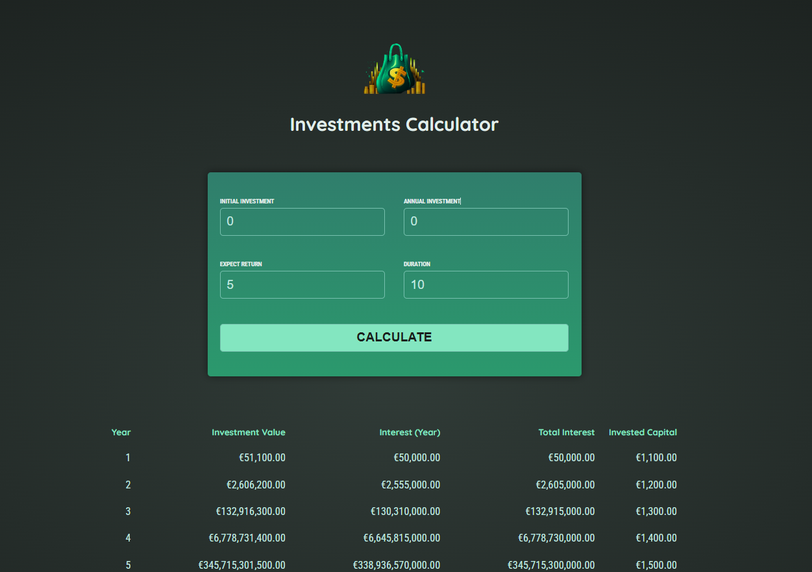

# Investments Calculator (Angular)



This project is an **Investments Calculator** built with Angular. It allows users to input investment parameters and calculates the growth of their investment over time, displaying results in a table format.

## Features
- Input initial investment, annual investment, expected return, and duration
- Calculates yearly investment growth and interest
- Displays results in a user-friendly table

## Technologies Used
- **Angular**: ^18.0.0
- **TypeScript**: ~5.4.2
- **RxJS**: ~7.8.0

## Getting Started

### Prerequisites
- [Node.js](https://nodejs.org/) (v18 or higher recommended)
- [Angular CLI](https://angular.io/cli) (v18)

### Setup
1. **Install dependencies**
   ```powershell
   npm install
   ```
2. **Run the development server**
   ```powershell
   ng serve
   ```
   Navigate to [http://localhost:4200/](http://localhost:4200/) in your browser.

### Build for Production
```powershell
ng build
```
The build artifacts will be stored in the `dist/` directory.

### Running Tests
- **Unit tests:**
  ```powershell
  ng test
  ```
- **End-to-end tests:**
  (Add a package for e2e testing if needed, then run)
  ```powershell
  ng e2e
  ```

## Project Structure
- `src/app/` - Main application code
- `public/` - Static assets (images, favicon)

## Further Help
- Angular CLI: `ng help`
- [Angular CLI Documentation](https://angular.io/cli)

---
*Generated on June 11, 2025*
